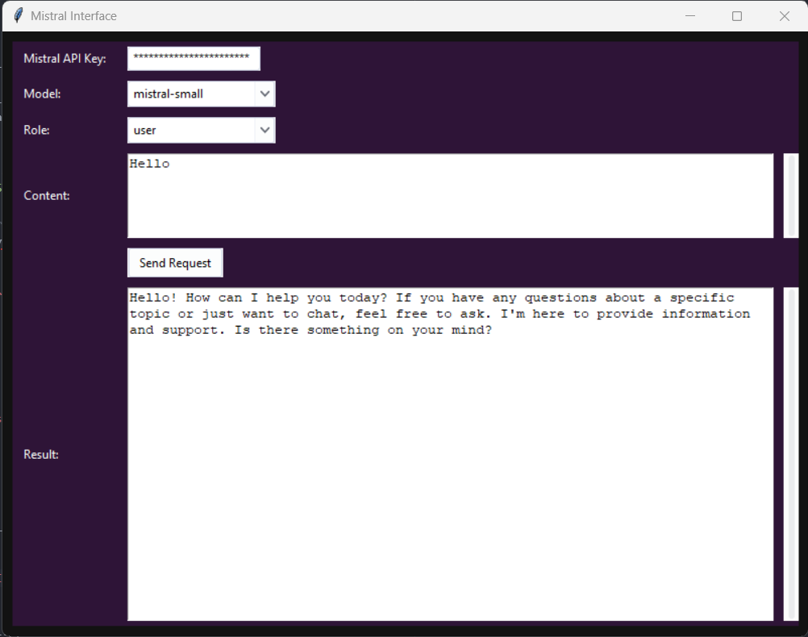

# Mistral Python Client

This client is inspired from [cohere-python](https://github.com/cohere-ai/cohere-python)

You can use the Mistral Python client to interact with the Mistral AI API.

## Installing

```bash
pip install mistralai
```

### From Source

This client uses `poetry` as a dependency and virtual environment manager.

You can install poetry with

```bash
pip install poetry
```

`poetry` will set up a virtual environment and install dependencies with the following command:

```bash
poetry install
```

## Run examples

You can run the examples in the `examples/` directory using `poetry run` or by entering the virtual environment using `poetry shell`.

### API Key Setup

Running the examples requires a Mistral AI API key.

1. Get your own Mistral API Key: <https://docs.mistral.ai/#api-access>
2. Set your Mistral API Key as an environment variable. You only need to do this once.

```bash
# set Mistral API Key (using zsh for example)
$ echo 'export MISTRAL_API_KEY=[your_key_here]' >> ~/.zshenv

# reload the environment (or just quit and open a new terminal)
$ source ~/.zshenv
```

### Using poetry run

```bash
cd examples
poetry run python chat_no_streaming.py
```

### Using poetry shell

```bash
poetry shell
cd examples

>> python chat_no_streaming.py
```

## Mistral GUI

You can also use a user-friendly graphic interface in the `gui/` directory to interact with Mistral AI models (mistral-tiny, mistral-small, mistral-medium).



### Requirements

1. Get your own Mistral API Key: <https://docs.mistral.ai/#api-access>
2. Install these Python modules:
```bash
pip install requests
pip install tk
pip install ttkthemes
```

### Run

```bash
cd gui
python mistral_gui.py
```
